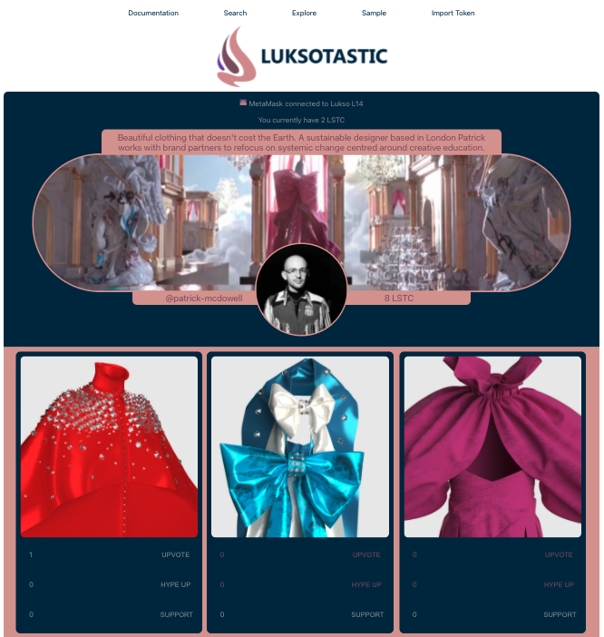
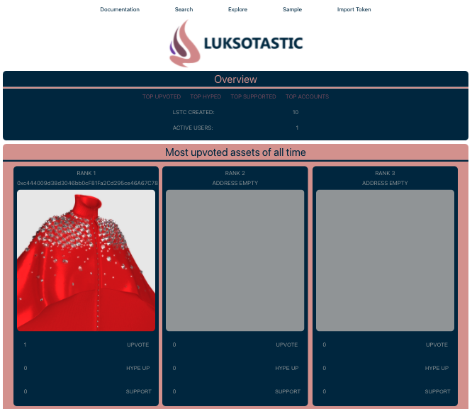
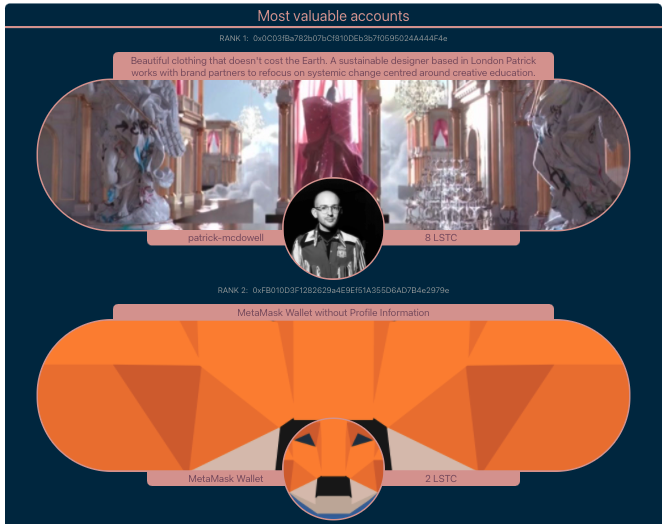

# LUKSOTASTIC

Contribution to the "Hack your Profile" Hackathon from LUKSO

## 1. Introduction

This project is a contribution to the "Hack your Profile" Hackathon from the LUKSO Network. Users can execute the application in modern browsers connected to MetaMask on the LUKSO L14 test network.

The LUKSO Blockchain is a Web3 network for the creative economy, combining fundamentally new smart contract standards with digital and physical goods. Forming a community around the project is essential. Currently, these interactions break down to communicating over Twitter or dedicated discord channels. The lack of social media platforms on LUKSO leads to creating an application where users can interact with profiles directly.

**LUKSOTASTIC** offers a **Lightway Social Media Platform featuring it's Social Currency LSTC** to add reactions to NFT's and reputation to universal profiles. Users can log in to the application by using the browser extension MetaMask. Anyone can enter a profile's address to load data front its universal profile into the application. Their assets can be upvoted, hyped up, or supported by one single transaction. Every interaction earns users and the profile's owner LSTC tokens, which symbolizes their reputation. The token is uniquely bound to accounts or wallets and might be used to enter community events or gain advantages from external applications that dock onto LUKSOTASTIC.

Project Links:

- [Live webpage](https://www.luksotastic.com)
- [Twitter](https://twitter.com/luksotasticapp)
- [Instagram](https://www.instagram.com/luksotastic/)

Guides used to integrate software:

- [LUKSO Tech Docs](https://docs.lukso.tech/tools/getting-started)
- [LUKSO Networks](https://docs.lukso.tech/networks/l14-testnet/)

Programming Languages:

- Solidity (Smart Contract)
- JavaScript (Browser Wallet)

Script Languages:

- HTML (React Rendering)
- CSS (Formatting/Animation)

## 2. Showcase

[YouTube Channel with Showcase](https://www.youtube.com/channel/UCy1csiV8jDnhyQ5mineUXVA/featured)

## 3. Setup

 

### 3.1 Preparation

The Application will need **npm** and **Node.js** installed on the machine. Follow these steps [here](https://www.npmjs.com/get-npm) to get ready.

### 3.2 Installation

` git clone [this project]` 
`cd ./luksotastic` 
`npm install --save web3` 
`npm install --save @erc725/erc725.js` 
`npm install --save react-scroll`

`npm install`

### 3.3 Start the Application

`cd ./[project_root]` 
`npm run start`

The Application is now running at
`localhost:3000`

To stop the Application use `Ctrl+C` in terminal

## 4. Avalable Developer Scripts

#### `npm start`

Runs the app in the development mode. Open [http://localhost:3000](http://localhost:3000) to view it in the browser. The page will reload if you make edits. You will also see any lint errors in the console.

#### `npm test`

Launches the test runner in the interactive watch mode. See the section about [running tests](https://facebook.github.io/create-react-app/docs/running-tests) for more information.

#### `npm run build`

Builds the app for production to the `build` folder. It correctly bundles React in production mode and optimizes the build for the best performance. The build is minified and the filenames include the hashes. See the section about [deployment](https://facebook.github.io/create-react-app/docs/deployment) for more information.
